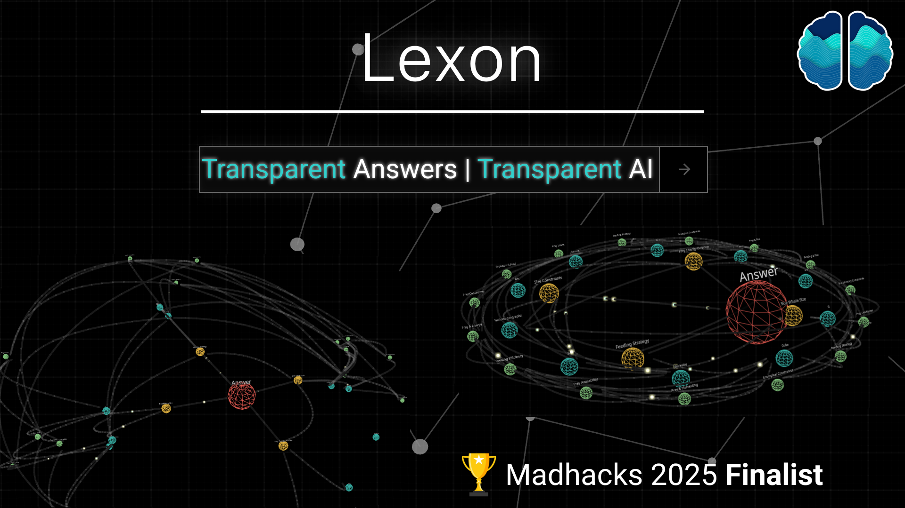
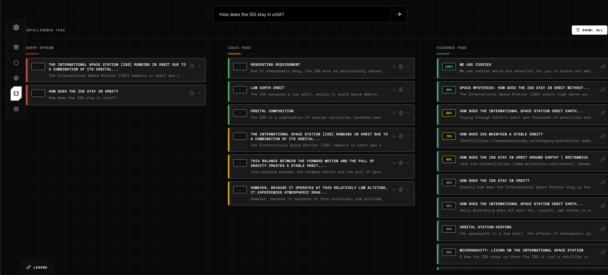
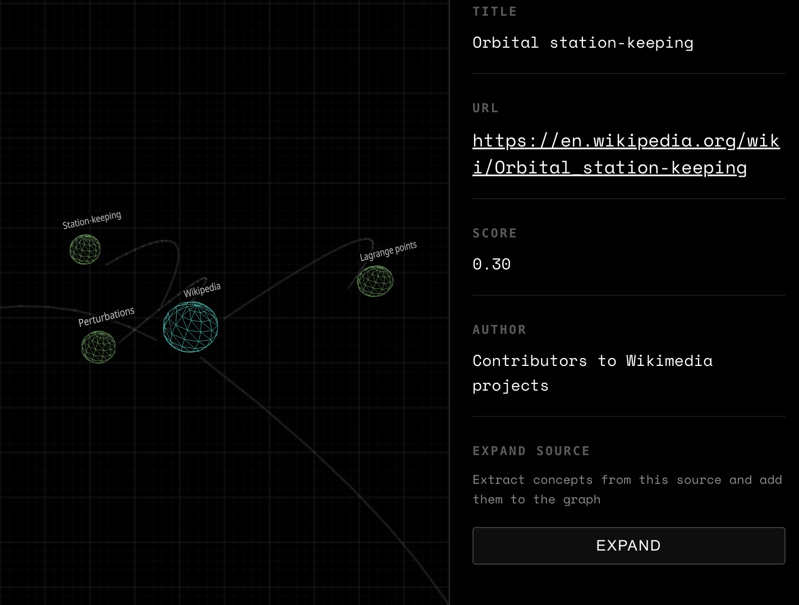

# Lexon AI

> Transparent Answers with a 3D Evidence Graph

[](https://www.typescriptlang.org/)
[](https://reactjs.org/)
[](https://threejs.org/)
[](https://expressjs.com/)
[](https://openai.com/)
[](https://exa.ai/)

<p align="center">
  
</p>

Lexon AI is a transparent answer system that solves the "AI black box" problem. Every answer is fully verifiable through source attribution and an interactive 3D evidence graph that visualizes exactly how conclusions are reached.

**Built for MadHacks 2025.**

### Project Links

- **Demo Website:** [lexon-ai.vercel.app](https://lexon-ai.vercel.app/)
- **Devpost Project Page:** [devpost.com/software/lexon](https://devpost.com/software/lexon)

---

## Overview

Traditional AI systems generate answers from training data with no way to verify claims or trace reasoning. Users are left trusting a black box, unable to distinguish fact from hallucination.

Lexon AI enforces transparency through strict separation of concerns:

- **User question** is received
- **Exa neural search** retrieves relevant web sources
- **GPT-4o-mini** generates answers using ONLY those sources (never training data)
- **Evidence graph builder** constructs a 4-layer graph linking claims to sources
- **3D visualization** lets users explore the reasoning interactively

Every claim is traceable. Every source is verifiable.

---

## AI Transparency Platform

Lexon functions as a complete AI transparency platform with three core components: a research agent (Exa), an answer agent (GPT-4o-mini constrained to sources), and an evidence graph builder that links every claim to its origin.

<p align="center">
  
</p>

The **Knowledge Deck** view provides structured transparency:

- **Query Stream** — The original question and synthesized answer blocks
- **Logic Feed** — Reasoning chunks showing key claims with source citations
- **Evidence Feed** — Ranked sources from Exa with relevance scores (0-100%)

<p align="center">
  
</p>

**Architecture Overview:**

- **Frontend** — Vite + React + React Three Fiber for 3D graph visualization
- **Backend** — Node/Express API with research agent, answer agent, and graph builder
- **External APIs** — Exa for neural search, OpenAI for constrained answer generation

---

## Visual Simulation

The 3D evidence graph places the answer at center with concepts, sources, and supporting evidence orbiting in concentric layers—like exploring a solar system of knowledge.

<p align="center">
  
</p>

**Layout Modes:**

- **Cluster** — Hierarchical grouping with orbit-style paths (default)
- **Circular** — 2D radial layout for simpler exploration
- **Globe** — Nodes distributed on a 3D sphere surface
- **Knowledge Deck** — Structured panel view with query/logic/evidence feeds
- **Baseline** — Flat layer-based arrangement

**Color Modes:** White (clean monochrome), By Level (depth-based), By Role (node type), By Tier (layer hierarchy)

### Evidence Lines, Scores, and Expansion

The connecting lines represent relationships:
- `answers` — Question to answer, answer to blocks
- `supports` — Blocks to sources (citations)
- `underpins` — Sources to supporting concepts
- `semantic_related` — Similarity-based connections

Each source displays a **relevance score** (0-100%) from Exa's neural search, visible in the Evidence Feed and node details.

The **expand** function transforms a source node into a richer concept subgraph, enabling deeper research exploration—turning Lexon into a research lens, not just an answer.

<p align="center">
  
</p>

---

## Key Features

- **Evidence-first pipeline** — LLM restricted to retrieved sources only
- **4-layer evidence graph** — Question → Answer → Direct sources → Supporting concepts
- **Multiple 3D layouts** — Cluster, circular, globe, knowledge deck, baseline
- **Color-coded visualization** — By level, role, tier, or clean white theme
- **Knowledge Deck view** — Structured query/logic/evidence feeds
- **Expandable sources** — Click to explore deeper research subgraphs
- **Real-time graph construction** — Watch answers and graphs build dynamically
- **Smooth camera controls** — Orbit, pan, zoom with hover/click interactions
- **Graceful degradation** — System continues if research or generation partially fails

---

## Quick Start

### Prerequisites

- **Node.js 18+**
- **npm** or **pnpm**
- **Exa API Key** — [exa.ai](https://exa.ai/)
- **OpenAI API Key** — [platform.openai.com](https://platform.openai.com/)

### Installation

```bash
# Clone the repository
git clone https://github.com/yourusername/lexon-ai.git
cd lexon-ai

# Install backend dependencies
cd backend
npm install

# Install frontend dependencies
cd ../frontend
npm install
```

### Environment Setup

Create `backend/.env`:

```env
EXA_API_KEY=your_exa_api_key_here
LLM_API_KEY=your_openai_api_key_here
PORT=3001
NODE_ENV=development
```

### Running the Application

**Terminal 1 — Backend:**
```bash
cd backend
npm run dev
# API at http://localhost:3001
```

**Terminal 2 — Frontend:**
```bash
cd frontend
npm run dev
# UI at http://localhost:5173
```

Open [http://localhost:5173](http://localhost:5173) in your browser.

---

## Usage

1. **Open the frontend** at localhost:5173
2. **Enter a question** in the input field (e.g., "What is AI transparency?")
3. **Wait for processing** — Exa searches, GPT generates, graph builds (~3-8 seconds)
4. **Explore the 3D graph** — Rotate (drag), zoom (scroll), pan (right-drag)
5. **Click nodes** to view full content, sources, and metadata
6. **Switch layouts** — Use controls to toggle cluster/circular/globe/deck views
7. **Expand sources** — Click a source node to explore deeper subgraphs

---

## Project Structure

```
lexon-ai/
├── backend/                      # Node.js/TypeScript API server
│   ├── src/
│   │   ├── index.ts              # Express server entry
│   │   ├── routes/
│   │   │   └── answerRoute.ts    # POST /api/answer endpoint
│   │   ├── services/
│   │   │   ├── researchAgent.ts  # Exa-based source retrieval
│   │   │   ├── answerAgent.ts    # GPT-4o-mini answer generation
│   │   │   ├── evidenceGraph.ts  # 4-layer graph construction
│   │   │   ├── secondarySourceAgent.ts  # Layer 3 extraction
│   │   │   └── semanticGraphBuilder.ts  # Similarity edges
│   │   ├── types/
│   │   │   └── shared.ts         # TypeScript definitions
│   │   └── config/
│   │       └── config.ts         # Environment configuration
│   └── scripts/                  # Test scripts
│
├── frontend/                     # React/Vite 3D visualization
│   ├── src/
│   │   ├── App.tsx               # Main application state
│   │   ├── components/
│   │   │   ├── GraphVisualization.tsx  # 3D scene orchestrator
│   │   │   ├── KnowledgeDeck.tsx       # Structured panel view
│   │   │   ├── Node.tsx                # Individual node rendering
│   │   │   ├── Edge.tsx                # Connection rendering
│   │   │   ├── NodeDetailPanel.tsx     # Node detail modal
│   │   │   └── controls/               # Layout/color controls
│   │   ├── utils/
│   │   │   ├── layoutEngine.ts   # Layout algorithms
│   │   │   └── colorPalettes.ts  # Color mode logic
│   │   └── types/
│   │       └── index.ts          # Frontend type definitions
│   └── public/
│       └── examples/             # Demo data for fallback
│
└── readme_assets/                # Documentation images
```

---

## API Endpoints

### `POST /api/answer`

Generate a transparent answer with evidence graph.

**Request:**
```json
{
  "question": "What is AI transparency?",
  "density": "medium"
}
```

**Parameters:**
- `question` (required) — The question to answer
- `density` (optional) — `"low"` (6 sources), `"medium"` (9, default), `"high"` (12)

**Response:**
```json
{
  "question": "What is AI transparency?",
  "answer": {
    "blocks": [
      { "id": "block_1", "type": "paragraph", "text": "...", "source_ids": ["src_1", "src_2"] }
    ]
  },
  "sources": [
    { "id": "src_1", "url": "https://...", "title": "...", "text": "...", "score": 0.95 }
  ],
  "evidence_graph": {
    "nodes": [...],
    "edges": [...]
  },
  "meta": { "degraded": false, "timestamp": "..." }
}
```

### `GET /health`

Health check endpoint returning server status and environment.

---

## Technologies

### Frontend

- **React 18** — Component architecture
- **Vite** — Fast dev server and builds
- **React Three Fiber** — React renderer for Three.js
- **@react-three/drei** — 3D helpers and abstractions
- **Three.js** — WebGL 3D rendering
- **Framer Motion** — UI animations
- **@react-spring/three** — Physics-based node animations
- **Lucide React** — Icon library

### Backend

- **Node.js + Express** — API server
- **TypeScript** — Type-safe implementation
- **Exa API** — Neural search for source retrieval
- **OpenAI GPT-4o-mini** — Constrained answer generation
- **Custom embeddings** — Semantic similarity for graph enhancement

### Infrastructure

- **Vercel** — Frontend deployment
- **Render** — Backend deployment

---

## License

MIT License — See [LICENSE](LICENSE) for details.

---

**Built with transparency at MadHacks 2025**
